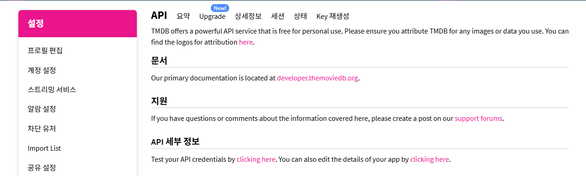
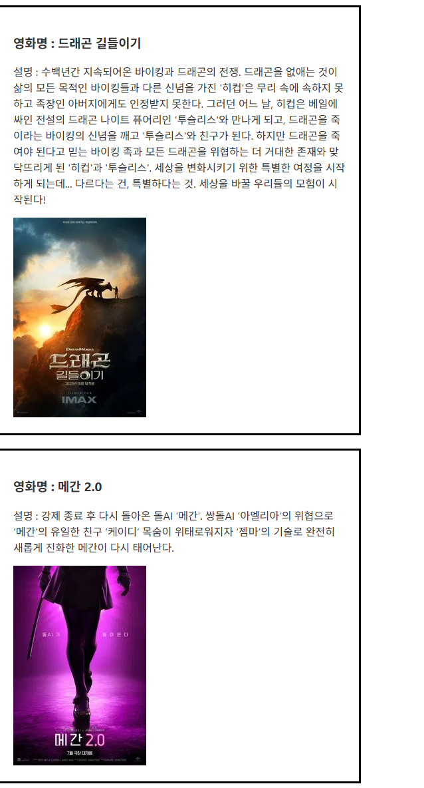

## 들어가며
> 이 포스트는 오시내님의 「LUVIT 새로운 웹 개발의 시작 스벨트」 11장부터 18장까지 읽고 개인적으로 학습한 내용을 정리한 글입니다.
> - 책: LUVIT 새로운 웹 개발의 시작 스벨트
> - 저자: 오시내
> - 출판사: 제이펍
> - 챕터: 11 ~ 18장 

# 핵심 내용 정리

## 20장 심플 프로젝트1: My Bucket List
### 프로젝트 생성 및 라이브러리  설치
- iconify , uuid 라이브러리 사용

### 컴포넌트 생성
- Header, content로 구성
    - content는 버킷 리스트, 리스트 단일 아이템, 데이터 추가 컴포넌트를 추가함

- header 설정

```javascript
<script>
    const today = new Date(); //오늘의 날짜와 시간 담는 변수
    const week = ["일", "월", "화", "수", "목", "금", "토"]; //요일을 문자로 담는 변수

    //각각 년, 월, 일, 요일을 담는 객체
    const dateString = {
        year: today.getFullYear(),
        month: today.getMonth() + 1,
        date: today.getDate(),
        day: today.getDay()
    };

    //비구조화할당 처리
    const { year, month, date, day } = dateString;
</script>

<div class="bucketheader">
    <h1>My Bucket List</h1>
    <h2>
        현재 : {year}년 {month}월 {date}일 {week[day]}요일
    </h2>
    <p>할 일 3개 남음</p>
</div>
```

- 버킷리스트와 리스트 안의 아이템들 추가

```javascript
<script>
    import BucketItem from "./BucketItem.svelte";
</script>

<div class="bucketlist">
    <BucketItem />
</div>
```

```javascript
<script>
    import Icon from '@iconify/svelte';
</script>

<div class="bucketitem">
    <input type="checkbox" id="chk" />
    <label for="chk" class="checkcircle">
        <Icon icon="ic:round-check" />
    </label>
    <p>버킷리스트 적기</p>
    <button class="remove">
        <Icon icon="gridicons:trash" />
    </button>
</div>
```

- 아이템 추가 컴포넌트

```javascript
<script>
    import Icon from '@iconify/svelte';
</script>

<div class="bucketcreate">
    <div class="createform">
    <form>
        <input
            type="text"
            placeholder="추가할 버킷리스트를 입력 후, Enter를 누르세요."
        />
    </form>
    </div>
    <button class="circlebox">
        <Icon icon="ic:round-add" />
    </button>
</div>
```

### BucketItem 이벤트 관리
- onToggle : check 처리
- onRemove : 리스트에서 아이템 삭제
- onEditMode : 더블클릭 시 수정되도록 처리

```javascript
<script>
	import BucketHeader from "./components/BucketHeader.svelte";
    import BucketList from "./components/BucketList.svelte";
    import BucketCreate from "./components/BucketCreate.svelte";
    import { initialBuckets } from "./bucketData";
    import { v4 as uuidv4 } from 'uuid';

    //버킷 데이터 상태 관리
    let buckets = initialBuckets;

    //버킷 텍스트를 담을 상태 변수 - 추가될 때 처리
    let bucketText = ''; 

    //editMode관련 상태관리
    let editMode = '';

    //체크 개수
    $: chkCount = buckets.filter((bucket) => !bucket.chk).length;

    //이벤트함수
    //1. chk속성값 변경 - CSS변화가 된다고 값이 변경되지 않음
    const onToggle = (id) => {
        buckets = buckets.map((bucket) => {
            return bucket.id === id ? { ...bucket, chk: !bucket.chk } : bucket;
        });
    }

    //2. 휴지통아이콘 누르면 삭제
    const onRemove = (id) => {
       buckets = buckets.filter((bucket) => bucket.id !== id);
    };

    //3. input의 change이벤트 처리
    const onDataChange = (e) => {
        bucketText = e.target.value;
    }

    //4. 버킷 데이터 추가
    const onSubmit = (e) => {
        e.preventDefault();
        console.log(bucketText);

        if(bucketText){
            const bucket = {
                id: uuidv4(),
                text: bucketText,
                chk: false
            };
            buckets = [...buckets, bucket];
        }
        bucketText = '';
    }

    //5. 텍스트를 변경할지 지정하는 이벤트 함수
    const onEditMode = (id) => {
        editMode = id
    }

    //6. 변경모드를 끝내는 이벤트 함수
    const offEditMode = () => {
        editMode = '';
    }

    //7. 데이터 수정 키보드 이벤트 하수
    const onEditKeyup = (e, editBucket) => {
        if(e.keyCode === 13){
            onEditItem(editBucket);
        }
    }

    //8. 데이터를 수정하는 이벤트 함수
    const onEditItem = (editBucket) => {
        buckets = buckets.map(bucket => {
            if(bucket.id === editBucket.id){
                bucket = editBucket
            }
            return bucket;
        });
        offEditMode();
    }
</script>

<svelte:head>
    <title>My Bucket List</title>
</svelte:head>
<div class="bucketbox">
    <BucketHeader {chkCount} />
    <!-- props 사용 -->
    <BucketList {buckets} {onToggle} {onRemove} {editMode} {onEditMode} {onEditKeyup} />
    <BucketCreate {bucketText} {onDataChange} {onSubmit} />
</div>
```

- header, list 등에서 사용 방법

```javascript
<script>
    export let chkCount;

    const today = new Date(); //오늘의 날짜와 시간 담는 변수
    const week = ["일", "월", "화", "수", "목", "금", "토"]; //요일을 문자로 담는 변수

    //각각 년, 월, 일, 요일을 담는 객체
    const dateString = {
        year: today.getFullYear(),
        month: today.getMonth() + 1,
        date: today.getDate(),
        day: today.getDay()
    };

    //비구조화할당 처리
    const { year, month, date, day } = dateString;
</script>

<div class="bucketheader">
    <h1>My Bucket List</h1>
    <h2>
        현재 : {year}년 {month}월 {date}일 {week[day]}요일
    </h2>
    <p>할 일 {chkCount}개 남음</p>
</div>
```


```javascript
<script>
    import { fade, slide } from "svelte/transition";
    import { flip } from "svelte/animate";
    import BucketItem from "./BucketItem.svelte";

    export let buckets;
    export let onToggle;
    export let onRemove;
    export let editMode;
    export let onEditMode;
    export let onEditKeyup;
</script>

<div class="bucketlist" >
    <!-- 전환효과 추가 -->
    {#each buckets as bucket, index(bucket) }
        <div in:fade out:slide animate:flip>
            <BucketItem {bucket} {onToggle} { onRemove } {editMode} {onEditMode} {onEditKeyup} />
        </div>
    {/each}
</div>
```

```javascript
<script>
    import Icon from '@iconify/svelte';
    import { v4 as uuidv4 } from 'uuid';

    //input 태그의 id 속성과 label 태그의 for 속성이 같이 사용할 id 처리
    let chkId = uuidv4();

    export let bucket;
    export let onToggle;
    export let onRemove;
    export let editMode;
    export let onEditMode;
    export let onEditKeyup;
</script>

<div class="bucketitem">
    <input 
        type="checkbox" id={chkId}
        bind:checked={bucket.chk}
    />
    <label 
        for={chkId} class="checkcircle"
        on:click={() => onToggle(bucket.id)}
        on:keydown={() => onToggle(bucket.id)}
        role="presentation"
    >
        <Icon icon="ic:round-check" />
    </label>
    {#if editMode === bucket.id}
        <input 
            type="text"
            bind:value={bucket.text}
            on:keyup={(e) => onEditKeyup(e, bucket)}
        />
    {:else}
        <p on:dblclick={() => onEditMode(bucket.id)}>{bucket.text}</p>
    {/if}
    <button 
        class="remove"
        on:click={() => onRemove(bucket.id)}
    >
        <Icon icon="gridicons:trash" />
    </button>
</div>
```

### 스토어를 통한 리팩토링

- 커스텀 스토어 수정

```javascript
import { writable, derived } from "svelte/store";
import { initialBuckets } from "./bucketData";
import { v4 as uuidv4 } from "uuid";

//커스텀 스토어
//버킷 데이터 관련을 store로 만들어 필요한 기능을 한번에 리턴
const setBucketData = () => {
    //데이터 담기 - 사용될 상태 변수를 묶은 데이터
    let initBucketData = {
        buckets: initialBuckets,
        editMode: ''
    }

    let bucketData = {...initBucketData};

    const { subscribe, update } = writable(bucketData);

    const onToggle = (id) => {
        update(
            datas => {
                const setDatas = datas.buckets.map((bucket) => {
                    return bucket.id === id ? { ...bucket, chk: !bucket.chk } : bucket;
                });
                datas.buckets = setDatas;
                return datas;
            }
        );
    }
    const onRemove = (id) => {
        update(
            datas => {
                const setDatas = datas.buckets.filter((bucket) => bucket.id !== id);
                datas.buckets = setDatas;
                return datas;
            }
        );
    };
    const onEditMode = (id) => {
        update(
            datas => {
                datas.editMode = id;
                return datas;
            }
        );
    }

    const offEditMode = () => {
        update(
            datas => {
                datas.editMode = '';
                return datas;
            }
        );
    }

    const onEditItem = (editBucket) => {
        update(
            datas => {
                const setDatas = datas.buckets.map(bucket => {
                    if(bucket.id === editBucket.id){
                        bucket = editBucket
                    }
                    return bucket;
                });
                datas.buckets = setDatas;
                return datas;
            }
        );
    }

    const onSubmit = (bucketText) => {
        if(bucketText){
            const bucket = {
                id: uuidv4(),
                text: bucketText,
                chk: false
            };

            update(
                datas => {
                    const setDatas = [...datas.buckets, bucket];
                    datas.buckets = setDatas;
                    return datas;
                }
            );
        }
        
    }

    //필요한 기능을 한번에 리턴
    return {
        subscribe,
        onToggle,
        onRemove,
        onEditMode,
        offEditMode,
        onEditItem,
        onSubmit
    }
}

//데이터 추가시 사용될 텍스트를 store로 만들어 필요한 기능을 한번에 리턴
const setFormBucket = () => {
    let formText = ''; 

    const { subscribe, update, set } = writable(formText);

    const resetFrom = () => { //값을 초기화
        set('');
    }

    //필요한 기능을 한번에 리턴
    return {
        subscribe,
        set,
        resetFrom
    }
}

//스토어로부터 파생된 새로운 스토어 생성
const setChkCount = () => {
    const count = derived(buckets, $buckets => {
        return $buckets.buckets.filter((bucket) => !bucket.chk).length;
    });
    return count;
}

export const bucketText = setFormBucket();
export const buckets = setBucketData();
export const chkCount = setChkCount();
```

### 각각 콤포넌트에서 스토어로 접근해 처리

- 리스트

```javascript
<script>
    import { buckets } from '../store';
    import { fade, slide } from "svelte/transition";
    import { flip } from "svelte/animate";
    import BucketItem from "./BucketItem.svelte";
</script>

<div class="bucketlist" >
    <!-- 전체 데이터 변경 -->
    {#each $buckets.buckets as bucket, index(bucket) }
        <div in:fade out:slide animate:flip>
            <BucketItem {bucket} />
        </div>
    {/each}
</div>
```

- 아이템에서 스토어에 접근하기 

```javascript
<script>
    import { buckets } from '../store';
    import Icon from '@iconify/svelte';
    import { v4 as uuidv4 } from 'uuid';

    let chkId = uuidv4();

    export let bucket;
    
    const { onToggle, onRemove, onEditMode, offEditMode, onEditItem } = buckets;

    const onEditKeyup = (e) => {
        if(e.keyCode === 13){
            onEditItem(bucket);
            offEditMode();
        }
    }
</script>

<div class="bucketitem">
    <input 
        type="checkbox" id={chkId}
        bind:checked={bucket.chk}
    />
    <label 
        for={chkId} class="checkcircle"
        on:click={() => onToggle(bucket.id)}
        on:keydown={() => onToggle(bucket.id)}
        role="presentation"
    >
        <Icon icon="ic:round-check" />
    </label>
    {#if $buckets.editMode === bucket.id}
        <input 
            type="text"
            bind:value={bucket.text}
            on:keyup={(e) => onEditKeyup(e, bucket)}
        />
    {:else}
        <p on:dblclick={() => onEditMode(bucket.id)}>{bucket.text}</p>
    {/if}
    <button 
        class="remove"
        on:click={() => onRemove(bucket.id)}
    >
        <Icon icon="gridicons:trash" />
    </button>
</div>
```

## 21장 심플 프로젝트 2: Best Tour
### 컴포넌트 생성
- Title.svelte : 제목 컴포넌트
- BestList.svelte : 여행 리스트 컴포넌트
- BestItem.svelte : 여행 리스트 한 개를 표현할 컴포넌트
- BestCreate.svelte : 추가할 입력 폼과 버튼을 제공하는 컴포넌트

### 데이터 관리
- 데이터 파일 및 스토어에서 데이터 관리

```javascript
//배열 데이터만 담을 js파일
const initialBests = [
    {
        id: 1,
        name: "[프랑스] 오르세 프리미엄투어[오후]",
        price: 20000,
        descript: "프랑스 3대 미술관 중 하나로 뽑히며, 반고흐, 마네, 모네 등의 작품을 감상",
        image:"https://img1.daumcdn.net/thumb/R1280x0/?scode=mtistory2&fname=https%3A%2F%2Fblog.kakaocdn.net%2Fdn%2Fk0adz%2Fbtsydna0uHj%2F4EvYJ8EPiIOkSTazEroRQk%2Fimg.jpg",
        like: false
    },
    {
        id: 2,
        name: "[이탈리아] 피렌체투어(우피치포함)",
        price: 23000,
        descript: "꽃의 도시. 피렌체 역사 중 가장 화려했던 14세기 르네상스 시대로의 여행",
        image: "https://img1.daumcdn.net/thumb/R1280x0/?scode=mtistory2&fname=https%3A%2F%2Fblog.kakaocdn.net%2Fdn%2Fbmakiu%2FbtsyenIDeD8%2FKGR5sLarN6EEcLBtAVLv80%2Fimg.jpg",
        like: false
    }, 
    {
        id: 3,
        name: "[헝가리] 부다페스트 야경투어",
        price: 25000,
        descript: "유럽 3대 야경 중 하나인 부다페스트 야경은 안전하고 아름답게 여행",
        image: "https://img1.daumcdn.net/thumb/R1280x0/?scode=mtistory2&fname=https%3A%2F%2Fblog.kakaocdn.net%2Fdn%2Fl6QZI%2FbtsynB6Vt9I%2Fq3tczSGTJaKyzPIiFlvM60%2Fimg.jpg",
        like: false
    },
    {
        id: 4,
        name: "[체코] 베스트 체스키 끄르믈로프투어",
        price: 25000,
        descript: "마치 동화에 나올 법한 빨간 지붕 중세마을이 그림처럼 소담하게 들어 앉아 있는 곳",
        image: "https://img1.daumcdn.net/thumb/R1280x0/?scode=mtistory2&fname=https%3A%2F%2Fblog.kakaocdn.net%2Fdn%2FbaN3Yb%2FbtsypwK3WoE%2FNtZmJDEaG93iJhyKBnRMw1%2Fimg.jpg",
        like: false
    },
    {
        id: 5,
        name: "[크로아티아] 두브로브니크 스르지산 투어",
        price: 20000,
        descript: "왕좌의 게임 촬영지, 두브로브니크 시내를 한눈에 볼 수 있는 스르지산 투어",
        image: "https://img1.daumcdn.net/thumb/R1280x0/?scode=mtistory2&fname=https%3A%2F%2Fblog.kakaocdn.net%2Fdn%2FcfnV8L%2FbtsyaUglYOD%2F3wDuGISkVsw106pjsn3KA0%2Fimg.jpg",
        like: false
    }, 
    {
        id: 6,
        name: "[프랑스] 루브르 프리미엄투어(소규모/오전)",
        price: 25000,
        descript: "건축 규모, 소장품 수, 역사의 시간 등 모든 부분의 세계 최고 프랑스 박물관",
        image: "https://img1.daumcdn.net/thumb/R1280x0/?scode=mtistory2&fname=https%3A%2F%2Fblog.kakaocdn.net%2Fdn%2FL8rOa%2FbtsygnaTPE5%2FNPfNWgUggkVb1asF3J5s30%2Fimg.jpg",
        like: false
    }, 
    {
        id: 7,
        name: "[이탈리아] 남부환상투어(~10/27)",
        price: 70000,
        descript: "내셔널지오그래픽 트레블러 선정, 죽기 전에 꼭 가봐야할 50곳 중 1위",
        image: "https://img1.daumcdn.net/thumb/R1280x0/?scode=mtistory2&fname=https%3A%2F%2Fblog.kakaocdn.net%2Fdn%2FclWmDF%2FbtsybQLxx0X%2FC4OIeCBGtFJUFSqxZIjfxK%2Fimg.jpg",
        like: false
    }
];
  
export { initialBests };
```

```javascript
import { writable } from "svelte/store";
import { initialBests } from './bestData';
import { v4 as uuidv4 } from 'uuid';

//커스텀 스토어
//데이터 관련을 store로 만들어 필요한 기능을 한번에 리턴
const setBestData = () => {
    //데이터 담기 - 사용될 상태
    const { subscribe, update } = writable(initialBests);

    const onToggle = (id) => {
        update(
            datas => {
                const setDatas = datas.map((best) => {
                    return best.id === id ? { ...best, like: !best.like } : best;
                });
                datas = setDatas;
                return datas;
            }
        );
    }

    const onRemove = (id) => {
        update(
            datas => {
                const setDatas = datas.filter((best) => best.id !== id);
                datas = setDatas;
                return datas;
            }
        );
    };

    const onSubmit = (bestTexts) => {
        if(bestTexts){
            const best = {
                id: uuidv4(),
                name: bestTexts.name,
                price: bestTexts.price,
                descript: bestTexts.descript,
                image: bestTexts.image,
                like: false
            };

            update(
                datas => {
                    const setDatas = [...datas, best];
                    datas = setDatas;
                    return datas;
                }
            );
        }
        
    }

    return {
        subscribe,
        onToggle,
        onRemove,
        onSubmit
    }
}

//데이터 추가시 사용될 텍스트를 store로 만들어 필요한 기능을 한번에 리턴
const setFormBest = () => {
    let formText = {
        name: '',
        price: '',
        image: '',
        descript: ''
    }; 

    const { subscribe, update, set } = writable(formText);

    const resetForm = () => { //값을 초기화
        set('');
    }

    //필요한 기능을 한번에 리턴
    return {
        subscribe,
        set,
        resetForm
    }
}

export const bestTexts = setFormBest();
export const bests = setBestData();
```

### 컴포넌트 구성 및 전체 코드

- App.svelte

```javascript
<script>
	import Title from "./components/Title.svelte";
	import BestList from "./components/BestList.svelte";
	import BestCreate from "./components/BestCreate.svelte";
</script>

<div class="bestbox">
	<Title name="BEST TOUR" />
	<BestList />
	<BestCreate />
</div>
```

- BestItem 

```javascript
<script>
    import { bests } from '../store';
    import Icon from '@iconify/svelte';

    export let best;

    //props를 비구조화할당
    const { id, name, price, descript, image, like } = best;

    //스토어 이벤트 함수를 비구조화할당
    const { onToggle, onRemove } = bests;
</script>

<li>
    <a href="#!">
        
        <button class="likebox" on:click={() => onToggle(id)}>
            {#if like}
                <Icon icon="tdesign:heart-filled" />
            {:else}
                <Icon icon="tdesign:heart" />
            {/if}
        </button>
        <div class="box">
            <h4>{name}</h4>
            <h5>\ {price.toString().replace(/\B(?=(\d{3})+(?!\d))/g, ",")}</h5>
            <p>{descript}</p>
            <button on:click={() => onRemove(id)}>
                <Icon icon="gridicons:trash" />
            </button>
        </div>
    </a>
</li>
```

- BestList 

```javascript
<script>
    import { bests } from '../store';
    import BestItem from './BestItem.svelte';
</script>

<ul>
    {#each $bests as best, index(best) }
        <BestItem {best} />
    {/each}
</ul>

```

- BestCreate : 생성 컴포넌트
```javascript
<script>
    import { bests, bestTexts } from '../store';
    import Icon from '@iconify/svelte';
    import { v4 as uuidv4 } from 'uuid';

    const id01 = uuidv4();
    const id02 = uuidv4();
    const id03 = uuidv4();
    const id04 = uuidv4();

    //오픈 관련 값을 담는 변수
    let open = false; //처음엔 열려있지 않아서 false

    //입력창 열기
    const onToggle = () =>  { 
        open = !open 
        if(!open){
            bestTexts.resetForm();
        }
    };
    
    //입력창 닫기
    const onClose = () => open = false;

    const onDataChange = (e) => {
        //비구조화할당
        const { name, value } = e.target; 

        //state값 변경
        $bestTexts = {
            ...$bestTexts,
            [name]: value
        }
    }

    const onSubmit = (e) => {
        e.preventDefault();
        bests.onSubmit($bestTexts);
        bestTexts.resetForm();
    }
</script>
<div>
    <form 
        class={open ? "createform active" : "createform"}
        on:submit={(e) => { onSubmit(e); onClose(); }}
    >
        <fieldset>
        <legend>여행 추가하기</legend>
            <label for={id01}>여행명 : </label>
            <input type="text" id={id01} name="name" bind:value={$bestTexts.name} on:change={(e) => onDataChange(e)} required />
            <label for={id02}>가격 : </label>
            <input type="text" id={id02} placeholder="숫자로만 입력하세요" name="price" bind:value={$bestTexts.price} on:change={(e) => onDataChange(e)} required />
            <label for={id03}>이미지경로 : </label>
            <input type="text" id={id03} name="image" bind:value={$bestTexts.image} on:change={(e) => onDataChange(e)} required />
            <br />
            <label for={id04} class="dlabel">설명 : </label>
            <textarea rows="5" id={id04} name="descript" bind:value={$bestTexts.descript} on:change={(e) => onDataChange(e)} required />
            <br />
            <button type="submit">여행추가하기</button>
        </fieldset>
    </form>
    <button class="circlebox" on:click={onToggle}>
        <Icon icon="ic:round-add" />
    </button>
</div>
```

## 22장 라우터
> 라우팅 : URL 주소에 따라 다른 페이지를 표시하는 기술
> SPA : 단일 페이지로 여러 링크를 구성하는 방법

### svelte-routing의 기본 사용법
- svelte-routing의 기본 문법

```javascript
<script>
    import {Router, Link, Route} from "svelte-routing";

    export let url = '';
</script>

<component 처리>
    <Router {url}>
        <Link to="바뀔경로"> link text </Link>
        <Route path="path" component={componentName}>
    </Router>
</component 처리>

```

- Router : 페이지 변환이 있는 컴포넌트들을 담아주는 부모 컴포넌트, url 속성 처리
- Link : 페이지 이동을 시켜주는 컴포넌트, to는 이동할 경로
- Route : 페이지 변환이 있는 각각 자손 컴포넌트를 담는 컴포넌트, path는 지정할 경로 속성, component는 해당 컴포넌트를 지정하는 속성

### 컴포넌트 예시

- 회사소개페이지


```javascript
// 348 page setcoin -> section
<section>
    <h2>회사소개페이지입니다.</h2>
</section>

<style>
    h2{ background-color: lightblue; }
</style>
```

- 메인페이지

```javascript
<main>
    <h2>메인페이지입니다.</h2>
</main>

<style>
    h2{ background-color: pink; }
</style>
```

```javascript
<section>
    <h2>오시는 길 페이지</h2>
</section>
<style>
    h2 { background-color: aquamarine;}
</style>
```

```javascript
<setcion>
    <h2>페이지를 찾을 수 없습니다.</h2>
</setcion>

<style>
    h2{ background-color: lightgray; }
</style>
```

- footer

```javascript
<footer>
    <h3>푸터</h3>
</footer>
```

- header

```javascript
<header>
    <h1>헤더</h1>
    <ul>
        <li><a href="#">Home</a></li>
        <li><a href="#">회사소개</a></li>
        <li><a href="#">오시는길</a></li>
        <li><a href="#">제품소개</a></li>
    </ul>
</header>
```

- App.svelte

```javascript
<script>
	import { Router, Route } from "svelte-routing";
	import Header from './common/Header.svelte';
	import Main from './pages/Main.svelte';
	import Map from './pages/Map.svelte';
	import Company from './pages/Company.svelte';
	import NotFound from './pages/NotFound.svelte';
	import Footer from './common/Footer.svelte';

	export let url = '';
</script>

<Header />
<Router {url}>
	<Route path="/" component={Main} />
	<Route path="/map/:id" component={Map} />
	<Route path="/company" component={Company} />
	<Route path="*" component={NotFound} />
</Router>
<Footer />
```

- header에 link 적용하기
- use:link를 개별 링크로 다는 것이 아니라 use:links를 사용함

```javascript
<script>
    import {Link} from "svelte-routing";
</script>
<header>
    <h1>헤더</h1>
    <ul use:links>
        <li><a href="/">Home</a></li>
        <li><a href="/compnay">회사소개</a></li>
        <li><a href="/map">오시는길</a></li>
        <li><a href="/product">제품소개</a></li>
    </ul>
</header>
```

### svelte-routing의 파라미터

- 파라미터 적용하기

```javascript
<script>
	import { Router, Route } from "svelte-routing";
	import Header from './common/Header.svelte';
	import Main from './pages/Main.svelte';
	import Map from './pages/Map.svelte';
	import Company from './pages/Company.svelte';
	import NotFound from './pages/NotFound.svelte';
	import Footer from './common/Footer.svelte';

	export let url = '';
</script>

<Header />
<Router {url}>
	<Route path="/" component={Main} />
	<Route path="/map/:id" component={Map} />
	<Route path="/company" component={Company} />
	<Route path="*" component={NotFound} />
</Router>
<Footer />
```

### 쿼리스트링을 이용한 주소 처리

- 스토어에 쿼리스트링 적용하기

```javascript
<script>
    import { afterUpdate } from 'svelte';
    import queryString from 'query-string'; // 쿼리스트링 적용
    import { links } from "svelte-routing";

    export let id;

    // URL쿼리 스트링 값 가지기
    let parsed = queryString.parse(window.location.search);
    afterUpdate(() => {
        parsed = queryString.parse(window.location.search);
    });

    const storeDatas = [
        {
            id: 1,
            name: '강남에비뉴점',
            addr: '서울특별시 서초구 서초대로77길 62',
            new: 'true'
        },
        {
            id: 2,
            name: '강남역신분당역사점',
            addr: '서울특별시 강남구 강남대로 396',
            new: 'false'
        },
        {
            id: 3,
            name: '강남우성점',
            addr: '서울특별시 강남구 강남대로 328',
            new: 'true'
        }
    ];
</script>

<section>
    <h2>오시는길페이지입니다.</h2>
    <ul use:links>
        {#each storeDatas as storeData, index(storeData) }
            <!-- 클릭 시 주소에 쿼리스트링 정보 처리 -->
            <li><a href={`/map/${storeData.id}?new=${storeData.new}`}>스토어{storeData.id}</a></li>
        {/each}
    </ul>
    <h3>
        {#if parsed.new === 'true'}
            <span style="color: red">NEW </span>
        {/if}
        { storeDatas[id-1].name }
    </h3>
    <p>{ storeDatas[id-1].addr }</p>
    
</section>

<style>
    h2{ background-color: aquamarine; }
</style>
```

## 23장 서버 데이터 통신
### REST API

- REST API의 주요 메서드

|함수|설명|주소 입력 방식|
|------|---|---|
|POST|데이터 등록|/test|
|GET|데이터 조회|/test , /test/1|
|PUT|데이터 수정|/test/1|
|DELETE|데이터 제거|/test/1|

- Fetch API 기본 문법

```javascript
fetch(url, options)
.then((response) => success command)
.catch((error) => fail command)
```

## axios 라이브러리

- axios 함수 문법1

```javascript
axios.get(url[,config]);
axios.post(url[,data[,config]]);
axios.put(url[,data[,config]]);
axios.delete(url[,config]);
```

- axios 함수 문법2
```javascript
axios({
    method: 'post',
    url: '/user/12345',
    data:{
        firstName: 'Fred',
        lastName:'Flinstone'
    }
})
```

- axios 예시

```javascript
<script>
    import { onMount} from 'svelte';
    import axios from 'axios';

    let comments = [];

    onMount(async () =>{
        const res = await axios.get(`https://jsonplaceholder.typicode.com/comments?_limit=21`);

        comments = await res.data;
    });
</script>

<h3>회원 정보</h3>
<div class="comments">
    {#each comments as comment}
        <article>
            <h4>이름 : {comment.name}</h4>
            <h4>이메일 주소 : {comment.email}</h4>
        </article>
    {:else}
        <p>loading...</p>
    {/each}
</div>

```

### await 블록을 이용한 통신 제어

- await 블록과 axios를 이용한 API 데이터 요청

```javascript
<script>
    import { onMount} from 'svelte';
    import axios from 'axios';

    let comments = [];

    const getComments = async () =>{
        try {
            const res = await axios.get(`https://jsonplaceholder.typicode.com/comments?_limit=21`);
            comments = await res.data;
            return res;

        }catch(error){
            throw new Error(error);
        }
    };
    let promise = getComments();
</script>

<h3>회원 정보</h3>
<div class="comments">
    {#await promise}
        <p>loading...</p>
    {:then}
        {#each comments as comment}
            <article>
                <h4>이름 : {comment.name}</h4>
                <h4>이메일 주소 : {comment.email}</h4>
            </article>
        {/each}
    {:catch error}
        <p> {error.message} : 에러가 발생했습니다.</p>
    {/await}
</div>

```

## 24장 TMDB API
- 영화 Open API 사용
- 회원가입 및 API 설정



- api 키 등록 및 결과



## 25장 SwiperJS 라이브러리
- SwiperJS 라이브러리 
    - Touch Slider 라이브러리
    - Mobile Touch Slider

### SwiperJS 활용 예제
- 기본 활용 예제

```javascript
<script>
    import { Swiper, SwiperSlide } from 'swiper/svelte';

    import 'swiper/css';

    const urls = [
        'https://img1.daumcdn.net/thumb/R1280x0/?scode=mtistory2&fname=https%3A%2F%2Fblog.kakaocdn.net%2Fdn%2Fk0adz%2Fbtsydna0uHj%2F4EvYJ8EPiIOkSTazEroRQk%2Fimg.jpg',
        'https://img1.daumcdn.net/thumb/R1280x0/?scode=mtistory2&fname=https%3A%2F%2Fblog.kakaocdn.net%2Fdn%2Fbmakiu%2FbtsyenIDeD8%2FKGR5sLarN6EEcLBtAVLv80%2Fimg.jpg',
        'https://img1.daumcdn.net/thumb/R1280x0/?scode=mtistory2&fname=https%3A%2F%2Fblog.kakaocdn.net%2Fdn%2Fl6QZI%2FbtsynB6Vt9I%2Fq3tczSGTJaKyzPIiFlvM60%2Fimg.jpg',
        'https://img1.daumcdn.net/thumb/R1280x0/?scode=mtistory2&fname=https%3A%2F%2Fblog.kakaocdn.net%2Fdn%2FbaN3Yb%2FbtsypwK3WoE%2FNtZmJDEaG93iJhyKBnRMw1%2Fimg.jpg',
        'https://img1.daumcdn.net/thumb/R1280x0/?scode=mtistory2&fname=https%3A%2F%2Fblog.kakaocdn.net%2Fdn%2FcfnV8L%2FbtsyaUglYOD%2F3wDuGISkVsw106pjsn3KA0%2Fimg.jpg'
    ];
</script>

<div class="photo">
    <Swiper>
        {#each urls as url, i}
            <SwiperSlide>
                
            </SwiperSlide>
        {/each}
    </Swiper>
</div>

<style>
    .photo{ width: 300px; margin: 0 auto; }
</style>
```

- 컨트롤 버튼 예제

```javascript
<script>
    import { Swiper, SwiperSlide } from 'swiper/svelte';
    import { Navigation, Pagination } from 'swiper'; //모듈 추가

    import 'swiper/css';
    import 'swiper/css/navigation'; //스타일 추가
    import 'swiper/css/pagination'; //스타일 추가

    const urls = [
        'https://img1.daumcdn.net/thumb/R1280x0/?scode=mtistory2&fname=https%3A%2F%2Fblog.kakaocdn.net%2Fdn%2Fk0adz%2Fbtsydna0uHj%2F4EvYJ8EPiIOkSTazEroRQk%2Fimg.jpg',
        'https://img1.daumcdn.net/thumb/R1280x0/?scode=mtistory2&fname=https%3A%2F%2Fblog.kakaocdn.net%2Fdn%2Fbmakiu%2FbtsyenIDeD8%2FKGR5sLarN6EEcLBtAVLv80%2Fimg.jpg',
        'https://img1.daumcdn.net/thumb/R1280x0/?scode=mtistory2&fname=https%3A%2F%2Fblog.kakaocdn.net%2Fdn%2Fl6QZI%2FbtsynB6Vt9I%2Fq3tczSGTJaKyzPIiFlvM60%2Fimg.jpg',
        'https://img1.daumcdn.net/thumb/R1280x0/?scode=mtistory2&fname=https%3A%2F%2Fblog.kakaocdn.net%2Fdn%2FbaN3Yb%2FbtsypwK3WoE%2FNtZmJDEaG93iJhyKBnRMw1%2Fimg.jpg',
        'https://img1.daumcdn.net/thumb/R1280x0/?scode=mtistory2&fname=https%3A%2F%2Fblog.kakaocdn.net%2Fdn%2FcfnV8L%2FbtsyaUglYOD%2F3wDuGISkVsw106pjsn3KA0%2Fimg.jpg'
    ];
</script>

<div class="photo">
    <!-- 모듈과 옵션 추가 -->
    <Swiper
        modules={[Navigation, Pagination]}
        navigation
        pagination={{ clickable: true }}
    >
        {#each urls as url, i}
            <SwiperSlide>
                
            </SwiperSlide>
        {/each}
    </Swiper>
</div>

<style>
    .photo{ width: 300px; margin: 0 auto; }
</style>
```

- SwiperJS 주요 클래스

|클래스 종류|설명|
|--|--|
|.swiper| <Swiper> 컴포넌트에 해당하는 클래스를 SwiperJS 전체를 담는 div 태그 요소 클래스|
|.swiper-slide| <SwiperSlide> 컴포넌트에 해당하는 각각 슬라이더 클래스|
|.swiper-slide-active| <SwiperSlide> 컴포넌트 중 실제 보이는 활성 컴포넌트 클래스|
|.swiper-button-prev| 이전 버튼 클래스|
|.swiper-button-next| 다음 버튼 클래스|
|.swiper-pagination| 원 버튼 전체 묶음 클래스 - 위치 저장용|
|.swiper-pagination-bullet| 원 버튼 한 개 클래스|
|.swiper-pagination-bullet-active| 활성 원 버튼 한 개 클래스|


