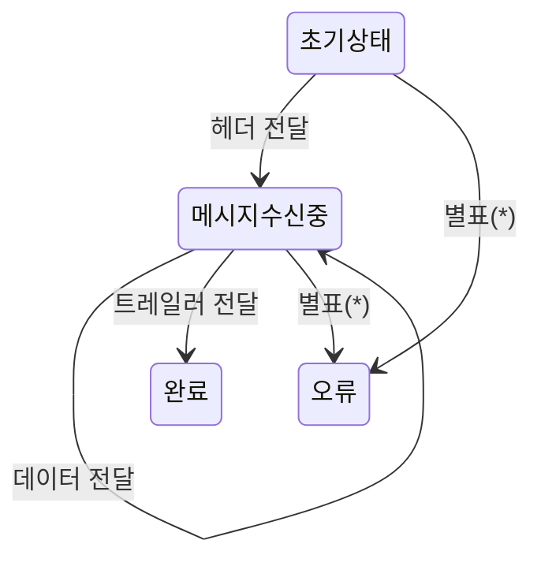

## 들어가며
> 이 포스트는 데이비드 토머스, 앤드류 헌트의 「실용주의 프로그래머」 Topic21 ~ 27까지 읽고 개인적으로 학습한 내용을 정리한 글입니다.
> - 책: 실용주의 프로그래머
> - 저자: 데이비드 토머스, 앤드류 헌트
> - 출판사: 인사이트
> - 챕터: Topic 29 Topic 31

# 핵심 내용 정리
## Topic 29. 실세계를 갖고 저글링하기
### 이벤트
- 이벤트는 무언가 정보가 있다는 것을 의미
- 이벤트에 잘 반응하는 애플리케이션을 만드는 전략
    - 유한 상태 기계
    - 감시자 패턴
    - 게시-구독
    - 반응형 프로그래밍과 스트림

### 유한 상태 기계(Finite State Machine)
#### 실용주의 FSM 해부학
- 상태 기계는 이벤트를 어떻게 처리할 지 정의한 명세
    - 상태마다 그 상태일 때 의미가 있는 이벤트들을 나열하고, 이벤트별로 시스템의 다음 '현재 상태'를 정의



- FSM의 좋은 점은 FSM을 오로지 데이터만으로 표현할 수 있다는 것

|상태|헤더|데이터|트레일러|기타|
|------|---|---|---|---|
|초기| 수신 중 | 오류 | 오류 | 오류 | 
|수신 중| 오류 | 수신 중 | 완료 | 오류 | 

#### 행동 추가하기
- 출력은 최종 상태
- 특정한 상태 이행이 일어날 때 수행하는 action을 추가해 FSM을 더 강력하게 만들 수 있다
- 예시
    - 사용자에게 신상 정보를 입력받고, 이메일 인증 등의 여러 단계의 상태 이행을 거쳐야하는데, 상태를 외부 저장소에 저장하면서 상태 기계를 동작시키면 작업 흐름이 필요한 요구 사항을 수월하게 처리할 수 있다

### 감시자 패턴
- observer pattern
    - 이벤트를 발생시키는 쪽인 감시 대상(observable)과 이벤트에 관심이 있는 클라이언트인 감시자로 이루어진다
    - 감시자는 자신이 관심 있는 이벤트를 감시 대상으로 등록
    - 해당 이벤트가 발생하면 감시 대상은 등록된 감시자 목록을 보면서 함수들을 일일이 호출하고 발생한 이벤트를 감시자 함수의 인자로 넘김
    - 사용자 인터페이스 시스템에서 널리 쓰이며, 사용자의 상호작용을 애플리케이션에 콜백으로 알려주는 방식 사용
- 감시자 패턴의 문제
    - 모든 감시자가 감시 대상에 등록 해야 하기 때문에 결함이 발생
    - 감시 대상이 콜백을 직접 호출하도록 구현하기 때문에 이 부분이 성능 병목이 될 수 있다

### 게시-구독
- publish-subscribe 
    - 감시자 패턴의 일반화
    - 감시자 모델의 결합도를 높이는 문제와 성능 문제도 해결
    - publisher-subscriber로 구성되고 channel로 연결
    - channel은 별도의 코드로 구현되고 채널에는 이름이 있다
    - 구독자는 관심사를 하나 이상의 채널에 등록하고, 게시자는 채널에 이벤트를 발생시킴
    - 게시자와 구독자의 연결은 비동기적으로 이루어짐
    - 대부분의 클라우드 서비스에서 이 서비스를 제공함
- 장단점
    - 추가적인 결합 없이 비동기 이벤트 처리를 구현해 다른 기존 코드를 수정하지 않고 이벤트 처리 코드를 추가하거나 교체할 수 있음
    - 애플리케이션이 작동하고 있는 도중에 작업이 가능할 수도 있다
    - 현재 벌어지는 일을 알 수 없음

## 반응형 프로그래밍과 스트림 그리고 이벤트
- 반응형 프로그래밍
    - 값이 바뀌면 그 값을 사용하는 다른 값이 react 하는 것
    - React, Vue가 그 예시
- 스트림
    - 이벤트가 코드가 반응하도록 연결해주는 것
    - 스트림은 이벤트를 일반적인 자료 구조처럼 다룰 수 있게 해줌

## Topic 30. 변환 프로그래밍
> Tip 49 프로그래밍은 코드에 관한 것이지만, 프로그램은 데이터에 관한 것이다
> Tip 50 상태를 쌓아 놓지 말고 전달하라
{: .prompt-tip }

## 변환 찾기
- 때에 따라선 요구 사항에서 시작하는 게 변환을 찾는 가장 쉬운 방법
    - 요구 사항에서 입력과 출력이 무엇인지 찾으면 전체 프로그램을 나타내는 함수가 결정되고, 입력을 출력으로 바꿔 가는 단계들을 찾으면 됨
- 데이터를 거대한 강의 흐름으로 생각하라
    - 파이프라인은 코드 > 데이터 > 코드 > 데이터의 연속이다

## 오류 처리는 어떻게 하나?
- 변환 사이에 값을 절대 날것으로 넘기지 않고, wrapper 역할을 하는 자료 구조나 타입으로 값을 싸서 넘긴다
- 오류 검사를 변환 안에서 하는 방식과 변환 바깥에서 하는 방식으로 수행
- 오류 검사를 변환 안에서 하는 방식

```java
/**
 * 변환 내부에서 오류 처리하는 예시
 */
public class InternalErrorHandlingConverter {
    
    /**
     * 문자열을 정수로 변환하는 메서드 (내부 오류 처리)
     */
    public Result<Integer> convertToInteger(String input) {
        // 입력값 검증
        if (input == null) {
            return Result.failure("입력값이 null입니다");
        }
        
        String trimmed = input.trim();
        if (trimmed.isEmpty()) {
            return Result.failure("입력값이 비어있습니다");
        }
        
        // 변환 시도
        try {
            int value = Integer.parseInt(trimmed);
            
            // 비즈니스 규칙 검증 (예: 양수만 허용)
            if (value < 0) {
                return Result.failure("양수만 허용됩니다");
            }
            
            return Result.success(value);
        } catch (NumberFormatException e) {
            return Result.failure("유효한 숫자 형식이 아닙니다: " + trimmed);
        }
    }
    
    // 사용 예시
    public void processValue(String userInput) {
        Result<Integer> result = convertToInteger(userInput);
        
        if (result.isSuccess()) {
            int value = result.getValue();
            System.out.println("변환된 값: " + value);
        } else {
            System.out.println("오류: " + result.getErrorMessage());
        }
    }
}

```

- 변환 바깥에서 하는 방식

```java
/**
 * 변환 외부에서 오류 처리하는 예시
 */
public class ExternalErrorHandlingConverter {
    
    /**
     * 입력값 검증 메서드 (변환 전 외부 검증)
     */
    public Result<String> validateInput(String input) {
        if (input == null) {
            return Result.failure("입력값이 null입니다");
        }
        
        String trimmed = input.trim();
        if (trimmed.isEmpty()) {
            return Result.failure("입력값이 비어있습니다");
        }
        
        // 숫자 형식인지 검증
        if (!trimmed.matches("-?\\d+")) {
            return Result.failure("유효한 숫자 형식이 아닙니다: " + trimmed);
        }
        
        return Result.success(trimmed);
    }
    
    /**
     * 비즈니스 규칙 검증 메서드 (변환 후 외부 검증)
     */
    public Result<Integer> validateBusinessRules(int value) {
        if (value < 0) {
            return Result.failure("양수만 허용됩니다");
        }
        return Result.success(value);
    }
    
    /**
     * 순수 변환 함수 (검증 없이 변환만 수행)
     */
    public int convertToInteger(String validInput) {
        return Integer.parseInt(validInput);
    }
    
    // 사용 예시
    public void processValue(String userInput) {
        // 1. 입력값 검증
        Result<String> validationResult = validateInput(userInput);
        if (!validationResult.isSuccess()) {
            System.out.println("입력 오류: " + validationResult.getErrorMessage());
            return;
        }
        
        // 2. 검증된 입력값으로 변환 수행
        int convertedValue = convertToInteger(validationResult.getValue());
        
        // 3. 비즈니스 규칙 검증
        Result<Integer> businessRuleResult = validateBusinessRules(convertedValue);
        if (!businessRuleResult.isSuccess()) {
            System.out.println("비즈니스 규칙 오류: " + businessRuleResult.getErrorMessage());
            return;
        }
        
        // 4. 최종 검증된 값 사용
        int finalValue = businessRuleResult.getValue();
        System.out.println("변환 및 검증된 값: " + finalValue);
    }
}

```

## Topic 31. 상속세
## 약간의 배경지식
- 상속
    - 1969년 simula67에서 처음 등장
    - 하나의 리스트에 다양한 종류의 이벤트를 담는 문제를 우아하게 풀어냄
    - 타입이 좋아서 혹은 싫어서 상속을 사용한다
    - 타입이 싫은 경우
        - 상속으로 공통 기능을 기반 클래스에서 자식 클래스로 넘기는 방식으로 사용

## 코드를 공유하기 위해 상속을 쓸 때의 문제
- 상속도 일종의 결합이다

## 타입을 정의하기 위해 상속을 쓸 때의 문제
- 클래스 사이의 아주 작은 미묘한 차이까지 잡아내 표현하기 위해 계층 위에 계층을 덧붙이면, 클래스 계층도가 벽면도를 모두 뒤덮을 수 있다

## 더 나은 대안
### 인터페이스와 프로토콜
- 인터페이스가 강력한 이유는 이들을 타입으로 사용할 수 있고, 해당 인터페이스를 구현하는 클래스라면 무엇이든 그 타입과 호환됨

### 위임
> Tip 52 서비스에 위임하라. Has-A가 Is-A보다 낫다
{: .prompt-tip }
#### 믹스인, 트레이트, 카테고리, 프로토콜 확장 등
- 믹스인
    - 클래스나 객체에 상속을 사용하지 않고 새로운 기능을 추가해 확장
    - 함수를 생성하고 이를 클래스나 객체로 확장하는 방식

## Topic 32. 설정
> Tip 55 외부 설정으로 애플리케이션을 조정할 수 있게 하라
{: .prompt-tip }
- 일반적으로 설정 데이터에 넣는 것
    - 데이터베이스나 외부 API 같은 외부 서비스의 인증 정보
    - 로그 레벨과 로그 저장 위치
    - 애플리케이션이 사용하는 포트 번호, IP 주소, 기계나 클러스터 이름
    - 특정 실행 환경에만 적용되는 검증 매개 변수
    - 외부에서 지정하는 매개 변수
    - 지역에 따른 세부 서식
    - 라이선스 키

## 정적 설정
- 정보를 일반 파일로 관리할 때는 일반 텍스트 형식을 사용하는 추세
- 애플리케이션은 설정을 자료 구조 형태로 불러옴

## 서비스형 설정(Configuration-As-A-Service)
- 설정 정보를 일반 파일이나 데이터베이스가 아니라 서비스 API 뒤에서 관리하는 것을 선호
- 서비스형 설정의 장점
    - 여러 애플리케이션이 설정 정보를 공유
    - 인증과 접근 제어를 붙여 애플리케이션마다 보이는 정보가 다르게 만들 수도 있다
    - 여러 인스턴스에 걸쳐 전체 설정을 한 번에 바꿀 수 있다
    - 설정 데이터를 전용 UI로 관리할 수 있다
    - 설정 데이터를 동적으로 계속 바꿀 수 있다