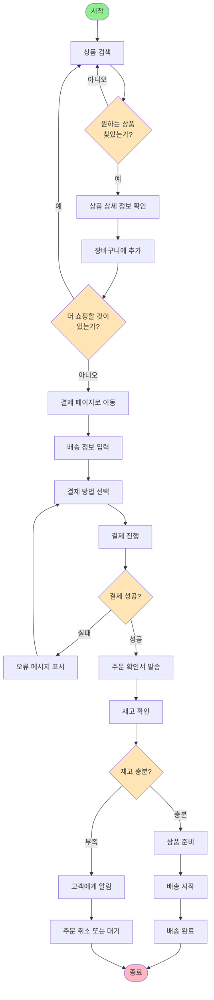

## 들어가며
> 이 포스트는 데이비드 토머스, 앤드류 헌트의 「실용주의 프로그래머」 Topic21 ~ 27까지 읽고 개인적으로 학습한 내용을 정리한 글입니다.
> - 책: 실용주의 프로그래머
> - 저자: 데이비드 토머스, 앤드류 헌트
> - 출판사: 인사이트
> - 챕터: Topic 33 Topic 36

# 핵심 내용 정리
# 동시성
- 동시성 
	- 둘 이상의 코드 조각이 실행될 때 동시에 실행 중인 것처럼 행동하는 것
- 병렬성
	- 실제로 동시에 실행되는 것

## Topic 33 시간적 결합 깨트리기
- 시간적 결합(temporal coupling)
	- 사람은 보통 직선적 사고를 하며, ‘이것을 하고, 그 다음 저것을 하고’라는 식으로 생각하면 시간적 결합이 발생한다
## 동시성 찾기
> Tip 56 작업 흐름 분석으로 동시성을 개선하라
- 활동 다이어그램

## 동시 작업의 기회
- 활동 다이어그램이 동시에 작업할 수 있는 부분을 보여주지만, 진짜로 동시에 하는 것이 좋은지는 알려주지 않는다
	- 코드가 아닌 곳에서 시간이 걸리는 활동을 찾아야한다
		- DB 조회, 외부 서비스에 접근, 사용자 입력 대기 등

## 병렬 작업의 기회
- 동시성은 소프트웨어 동작 방식, 병렬성은 하드웨어가 하는 것

## Topic 34 공유 상태는 틀린 상태
> Tip 57 공유 상태는 틀린 상태다
{: .prompt-tip }

## 비-원자적 갱신
- 두 프로세스가 같은 메모리 영역에 쓰기가 가능한 경우, 어느 프로세스도 자신이 보는 메모리가 일관되어 있음을 보장할 수 없다

### 세마포어 및 다른 상호 배제 방법
- 세마포어(semaphore)
	- 한 번에 한 사람만이 가질 수 있는 무언가
	- 세마포어를 만들어 다른 리소스의 사용을 제어하는 데 쓸 수 있다
	- 세마포어를 확보한 쪽은 평소처럼 계속 진행하고, 얻지 못한 쪽은 세마포어를 얻을 때 까지 대기
	- 세마포어를 이용한 방식은 모든 사람이 빠짐없이 세마포어를 사용해야‘만’ 제대로 동작한다는 것 -> 어떤 개발자가 약속을 지키지 않는 코드를 쓴다면 문제가 발생한다

## 트랜잭션이 없는 갱신
> Tip 58 불규칙한 실패는 동시성 문제인 경우가 많다
{: .prompt-tip }
- 수정가능한 리소스를 공유하는 애플리케이션 코드 어디에서나 동시성 문제가 발생할 수 있다

## 그 밖의 독점적인 접근
- 대부분의 언어에는 공유 리소스에 독점적으로 접근하는 것을 도와주는 라이브러리가 있다
	- 상호 배제를 의미하는 mutex, monitor, 세마포어 등으로 부른다
- 언어 자체에 동시성 지원이 들어 있는 언어도 있다

## Topic 35 액터와 프로세스
- 액터
	- 자신만의 비공개 지역 상태를 가진 독립적인 가상 처리 장치
	- 액터가 자고 있을 때 우편함에 메시지가 도착하면 액터가 깨어나면서 메시지를 처리
	- 처리가 끝나면 우편함의 다른 메시지를 처리하고, 우편함이 비어 있으면 다시 잠듦
	- 메시지 처리 시 액터는 다른 액터를 생성하거나 알고 있는 다른 액터에게 메시지를 보내거나 다음 메시지를 처리할 때의 상태가 될 새로운 상태를 생성할 수 있다
- 프로세스
	- 일반적인 가상 처리기
	- OS가 동시성을 지원하기 위해 구현

## 액터는 언제나 동시성을 띤다
> Tip 59 공유 상태 없는 동시성을 위해 액터를 사용하라
{: .prompt-tip }
- 액터를 관리하는 것은 하나도 없다
- 시스템이 저장하는 상태는 오직 메시지 그리고 액터의 지역 상태 뿐이고, 메시지는 수신자가 읽는 것 외에 확인할 방법이 없고, 지역 상태는 액터 바깥에서는 접근이 불가
- 모든 메시지는 일방향
- 액터는 각 메시지를 끝날 때까지 처리하고 중간에 다른 일을 하지 않는다. 한 번의 하나의 메시지만 처리
## 간단한 액터
- 자바 코드 필요
## 드러나지 않는 동시성
- 액터 모델에서는 동시성을 다루는 코드를 쓸 필요가 없다. 공유된 상태가 없기 때문이다
- 명시적으로 처음부터 끝까지 “이걸 한 다음 저걸 하라”는 코드를 쓸 필요도 없다. 액터가 수신하는 메시지에 따라 알아서 실행되기 때문
- 기반 아키텍처에 대한 언급도 필요없다. 이렇게 구성된 컴포넌트들은 단일 프로세서, 멀티 코어, 여러 컴퓨터가 네트워크로 연결되어 있든 똑같이 잘 작동

## 얼랭이 장을 마련하다 
- Erlang 언어와 런타임은 액터 구현의 좋은 사례

## Topic 36 칠판
## 칠판 사용 사례
- 칠판 시스템을 법적 요구 사항을 캡슐화하는 규칙 엔진과 함께 사용하면 어려움을 쉽게 해결할 수 있다

## 메시지 시스템과 칠판의 유사성
- 카프카나 NATS와 같은 메시징 시스템을 통해 이벤트 로그의 형태로 영속성을 제공하고, 패턴 매칭 형태로 메시지를 가져오는 것도 지원
- 메시징 시스템을 칠판으로도 사용할 수 있고, 여러 액터를 실행하는 플랫폼으로도 사용할 수 있다

## 하지만 그렇게 간단하지 않다
- 아키텍처에서 액터, 칠판, 마이크로 서비스를 사용하면 애플리케이션에서 생길 수 있는 모든 종류의 동시성 문제를 예방할 순 있으나, 많은 동작들이 간접적으로 일어나 분석이 어려워진다
- 이를 해결하기 위해 저장소에서 코드나 문서까지 생성하며, 메시지 형식 및 API를 모아두는 중앙 저장소를 운영하면 도움이 된다
	- 특정한 비지니스 작업 처리를 사용할 때 고유한 추적 아이디를 만들어 붙이고, 해당 작업에 관여하는 모든 액터로 아이디를 전파하면, 로그 파일을 통해 작업을 재구성해볼 수 있다
- 이런 분리는 시스템이 맞춰야하는 구성 요소 수가 많아져 배포나 관리가 어렵다
