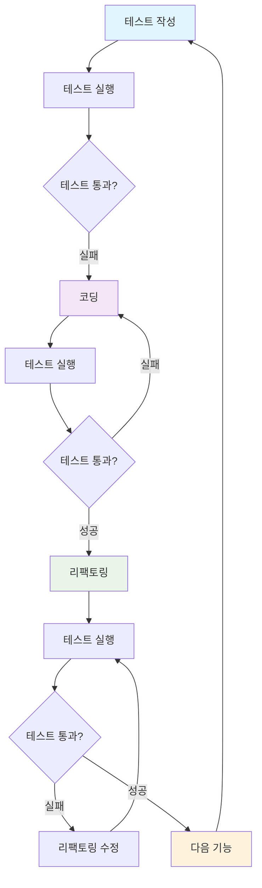

## 들어가며
> 이 포스트는 최범균의 「테스트 주도 개발 시작하기」 1~2장을 읽고 개인적으로 학습한 내용을 정리한 글입니다.
> - 책: 테스트 주도 개발 시작하기
> - 저자: 최범균
> - 출판사: 가메출판사
> - 챕터: 1~2장

# 핵심 개념 요약

## 2장 TDD 시작
## 첫 번째 테스트: 모든 규칙을 충족하는 경우
- 모든 규칙을 충족하는 경우
- 모든 규칙을 충족하지 않는 경우

## 두 번째 테스트: 길이만 8글자 미만이고 나머지 조건은 충족하는 경우
- 테스트 케이스

```java
public class PasswordSterengthMeterTest{

    @Test
    void meetsAllCriteriaThenStrong(){
        //...
    }

    @Test
    void meetsOtherCrriteriaExceptForLengthThenNormal(){
        PasswordStrengthMeter meter = new PasswordStrengthMeter();
        PasswordStrength result= meter.meter("ab12!@A");
        assertEquals(PasswordStrength.NORMAL, result);
    }

    public enum PasswordStrength {
        NORMAL, STRONG
    }
}
```
- PasswordStrengthMeter 클래스 추가

```java
public class PasswordStrengthMeter {
    public PasswordStrength meter(String s){
        // 전체 테스트 통과를 위한 코드 추가
        if(s.length() < 8){
            return PasswordStrength.NORMAL; 
        }
        return PasswordStrength.STRONG; 
    }
}
```

## 세 번째 테스트: 숫자를 포함하지 않고 나머지 조건은 충족하는 경우
- 숫자를 포함하지 않고 나머지 조건은 충족하는 암호 테스트를 통과하는 경우 추가

```java
public class PasswordStrengthMeter {
    public PasswordStrength meter(String s){
        // 전체 테스트 통과를 위한 코드 추가
        if(s.length() < 8){
            return PasswordStrength.NORMAL; 
        }
        boolean containsNum = false;
        for(char ch : s.toCharArray()){
            if( ch >= '0' &&& ch <='9' ){
                containsNum = true;
                break;
            }
        }
        if(!containsNum){
            return PasswordStrength.NORMAL; 
        }
        return PasswordStrength.STRONG; 
    }
}
```

## 네 번째 테스트: 값이 없는 경우

```java
public class PasswordSterengthMeterTest{

    @Test
    void meetsAllCriteriaThenStrong(){
        //...
    }

    @Test
    void meetsOtherCrriteriaExceptForLengthThenNormal(){
        PasswordStrengthMeter meter = new PasswordStrengthMeter();
        PasswordStrength result= meter.meter("ab12!@A");
        assertEquals(PasswordStrength.NORMAL, result);
    }

    @Test
    void nullInputThenInvalid(){
        assertStrength(null, PasswordStrength.INVALID);
    }

    public enum PasswordStrength {
        NORMAL, STRONG, INVALID
    }
}
```

- 대문자를 포함하지 않은 경우에 테스트를 통과시키기 위한 코드 추가


```java
public class PasswordStrengthMeter {
    public PasswordStrength meter(String s){
        // 전체 테스트 통과를 위한 코드 추가
        if(s == null || s.isEmpty()){
            return PasswordStrength.INVALID; 
        }
        if(s.length() < 8){
            return PasswordStrength.NORMAL; 
        }
     
        boolean containsNum = meetsContainingNumberCriteria(s);
        if(!containsNum){
            return PasswordStrength.NORMAL; 
        }

        boolean containsUpp = false;
        for(char ch : s.toCharArry()){
            if(Character.isUpperCase(ch)){
                containsUpp = true;
                break;
            }
        }
        
        if(!containsUpp){
            return PasswordStrength.NORMAL; 
        }
        return PasswordStrength.STRONG; 
    }
}
```

## 여섯 번째 테스트: 길이가 8글자 이상인 조건만 충족하는 경우

- WEAK 케이스 추가
```java
public class PasswordSterengthMeterTest{

    @Test
    void meetsAllCriteriaThenStrong(){
        //...
    }

    @Test
    void meetsOtherCrriteriaExceptForLengthThenNormal(){
        PasswordStrengthMeter meter = new PasswordStrengthMeter();
        PasswordStrength result= meter.meter("ab12!@A");
        assertEquals(PasswordStrength.NORMAL, result);
    }

    @Test
    void nullInputThenInvalid(){
        assertStrength(null, PasswordStrength.INVALID);
    }
    @Test
    void meetsOnlyLengthCriteriaThenWeak(){
        assertStrength("abdefghi", PasswordStrength.WEAK);
    }

    public enum PasswordStrength {
        NORMAL, STRONG, INVALID, WEAK
    }
}
```

- WEAK 실패를 수정

```java
public class PasswordStrengthMeter {
    public PasswordStrength meter(String s){
        // 전체 테스트 통과를 위한 코드 추가
        if(s.length() < 8){
            return PasswordStrength.WEAK; 
        }
        boolean containsNum = false;
        for(char ch : s.toCharArray()){
            if( ch >= '0' &&& ch <='9' ){
                containsNum = true;
                break;
            }
        }
        if(!containsNum){
            return PasswordStrength.NORMAL; 
        }
        return PasswordStrength.STRONG; 
    }
}
```

## TDD 흐름


- 레드-그린-리팩터
    - TDD 사이클을 Red-Green-Refactor로 부르기도 한다
    - 레트는 실패하는 테스트 : 실패하는 테스트를 보여줌
    - 그린은 성공하는 테스트 : 성공하는 테스트를 보여줌
    - 리팩터 : 그대로 리팩토링 과정

## 테스트가 개발을 주도
- 테스트 코드를 먼저 작성하면 테스트가 개발을 주도
- 테스트 추가 후 테스트를 통과시킬 만큼 기능을 구현
    - 테스트를 통과할만큼만 구현